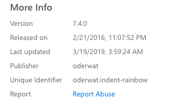

# Visual Studio Code - Extension készítés

## Leírás
Ha mindig is szerettél volna bővítményt készíteni a Visual Studio Code-hoz, de nem tudtad, hogy kezdj bele, akkor ez a kis segédlet neked szól.

**Fontos!** A segédlet a bővítmény csomagok készítését mutatja meg és nem a különálló bővítmény készítését!

## A csomaghoz szükséges
- Telepített [**Node.js**](https://nodejs.org/en/) az eszközre amin a bővítményt készíted
- [**Yeoman**](https://yeoman.io)
- [**Yo Code - Extension and Customization Generator**](https://github.com/Microsoft/vscode-generator-code)
- [**Microsoft fiók**](https://account.microsoft.com/account?lang=en-us)
- [**Management fiók**](https://marketplace.visualstudio.com/manage)
- [**Visual Studio Code**](https://code.visualstudio.com)

## Lépések
1. Futtasd az `npm install -g yo generator-code` parancsot. Ez a parancs telepíti a **Yeoman** és **Yo Code** csomagokat
2. Miután az előző parancs lefutott, navigálj el a mappába ahol a saját bővítményedet szeretnéd menteni és futtasd a `yo code` parancsot
3. A parancs lefutása után több lehetőség közül választhatsz, de most ezekre lesz szükség:
    - **What type of extension do you want to create?** New Extension Pack
    - **Add the currently installed extensions to the extension pack?** No (lehet yes is, ha minden letöltött bővítményed szeretnéd egyből hozzáadni)
    - **What's the name of your extension?** bővítmény-neve
    - **What's the identifier of your extension?** bővítmény-neve
    - **What's the description of your extension?** Egy kis leírás a bővítményhez
    - Ezután hasonlót láthatsz mint itt 
4. Nyisd meg a `package.json` fájlt, itt tudsz hozzáadni már meglévő bővítményeket a sajátodhoz. A bővítményeket **kulcs.érték**(egyedi azonosító) formában tudod megadni.
```json
"extensionPack": [
    "publisher.extensionName"
]
```
5. Keress néhány bővítményt amit szeretnél használni és add hozzá a `extensionPack` blokkhoz. Minden bővítmény rendelkezik saját egyedi azonosítóval, amit a bővítmény VS Code Marketplace  oldalán találhatsz meg jobb oldalt, a More Info rész alatt. Példának az [**ident-rainbow**](https://marketplace.visualstudio.com/items?itemName=oderwat.indent-rainbow) oldalán található azonosító: **oderwat.indent-rainbow**
    - 
6. Miután hozzáadtad a saját bővítményeid futtasd a `git init` parancsot a mappában és töltsd fel a projektet GitHubra. A `package.json` fájlban add hozzá a következő sorokat:
```json
"repository": {
    "type": "git",
    "url": "https://github.com/username/extension-repo"
}
```
7. Add hozzá a saját ikonod a projekthez (nem szükséges, de ilyenkor az alapértelmezett ikont látod majd). Az ikonnak legalább 128x128px felbontásúnak kell lennie és a projekt mappában kell elhelyezni. A következő sort add hozzá a `package.json` fájlhoz
```json
"icon": "icon.png"
```
8. Készíts egy `README.md` fájlt és írj egy kis összefoglalót a bővitményről
9. Töröld a `vsc-extension-quickstart.md` fájlt és a többi fölösleges fájlt mielőtt publikálod
10. A publikáláshoz szükséged lesz a [**Visual Studio Code Extension**](https://github.com/Microsoft/vscode-vsce)-re. Futtasd a következő parancsot: `npm install -g vsce`
11. Készíts egy [**Microsoft**](https://account.microsoft.com/account?lang=en-us) és [**management**](https://marketplace.visualstudio.com/manage) fiókot. A **management** fiókban készíts egy új publisher profilt, hogy hozzá tudd adni a bővítményed a VS Code merketplacehez
12. Miután kész a publisher fiókod, menj vissza a `package.json` fájlhoz és add hozzá a következő sort:
```json
"publisher": "a-saját-publisher-neved"
```
13. Futtasd a `vsce package` parancsot. Ez a parancs létrehozza a szükséges `VSIX` fájlt, ami tartalmazza a szükséges információkat a telepítéshez és futtatáshoz a bővítményedről
14. Töltsd fel az elkészült `VSIX` fájlt a **management** oldaladra
15. Kész!